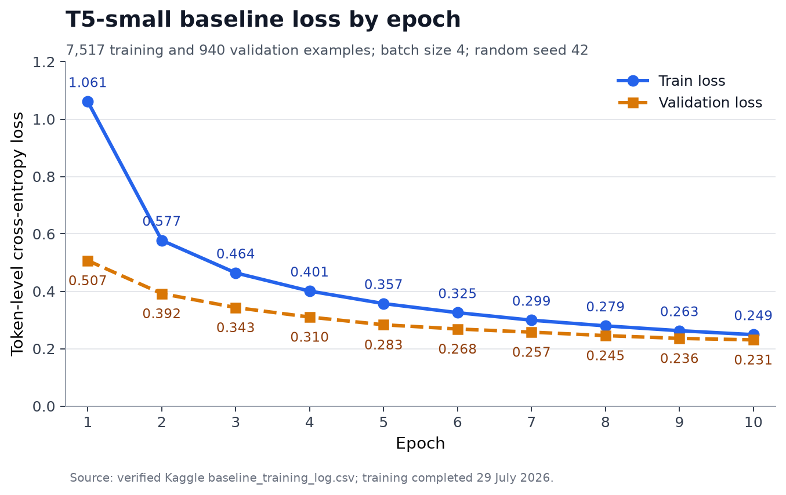

# Member 2 - T5-small Baseline Experiment Handoff

## Run Status

- Status: completed successfully on Kaggle
- Device: Tesla T4 (`cuda`)
- Dataset: `AI4DS/sql_generator_no_cot`
- Cleaned split sizes: 7,517 train / 940 validation / 940 test
- Complete test generation: 235 batches (approximately 3 minutes 43 seconds)
- Best checkpoint criterion: lowest validation loss
- Downloaded archive: `member2_baseline_output.zip`

## Baseline Assumptions

1. The prompt contains sufficient schema and question information for SQL generation.
2. Truncating inputs to 512 tokens and targets to 256 tokens does not remove essential
   content for most examples.
3. Treating SQL as a left-to-right sequence is an acceptable simple baseline, even
   though semantically equivalent SQL can use different clause or condition orderings.
4. Greedy decoding is used to keep the baseline deterministic and to leave beam search
   as a separately measurable improvement.
5. Validation loss is used for checkpoint selection, but it is not treated as SQL task
   accuracy.

## Incremental Verification

The pipeline was tested before the full experiment rather than only at the end:

1. A local one-batch test verified dataset loading, tokenisation, forward propagation,
   backpropagation, validation, checkpoint writing, and prediction CSV generation.
2. A Kaggle smoke test used 5 training batches, 2 validation batches, and 1 prediction
   batch on a Tesla T4. It completed without CUDA, data, or checkpoint errors.
3. The full run completed all 10 epochs and all 235 validation batches per epoch.
4. The downloaded result ZIP passed an integrity check and contained the model weights,
   tokenizer, model configuration, run configuration, ten-epoch loss log, 940
   predictions, and the complete-test metric summary.
5. Held-out predictions were inspected to confirm that the model learned SQL structure
   and to identify schema-linking and semantic failure cases.

## Reproducible Configuration

| Parameter | Value |
|---|---:|
| Model | `t5-small` |
| Optimizer | AdamW |
| Learning rate | `5e-5` |
| Batch size | `4` |
| Epochs | `10` |
| Random seed | `42` |
| Maximum input length | `512` |
| Maximum target length | `256` |
| Decoding | Greedy (`num_beams=1`) |

Equivalent command:

```bash
python -m src.baseline --epochs 10 --batch_size 4 --learning_rate 5e-5 --max_prediction_batches 235
```

## Loss History

| Epoch | Train loss | Validation loss |
|---:|---:|---:|
| 1 | 1.0610 | 0.5069 |
| 2 | 0.5774 | 0.3919 |
| 3 | 0.4640 | 0.3432 |
| 4 | 0.4006 | 0.3101 |
| 5 | 0.3571 | 0.2832 |
| 6 | 0.3254 | 0.2685 |
| 7 | 0.2992 | 0.2575 |
| 8 | 0.2794 | 0.2454 |
| 9 | 0.2626 | 0.2357 |
| 10 | 0.2487 | 0.2306 |

Both losses decreased across all ten epochs. Epoch 10 produced the lowest validation
loss and was therefore saved as the best checkpoint. The validation curve had not fully
plateaued, but the improvement per epoch was becoming smaller and there was no
loss-curve evidence of overfitting. These losses are training diagnostics, not
Text-to-SQL task accuracy.



**Figure 1.** Training and validation token-level cross-entropy loss across the ten
baseline epochs. Both series decreased, with no loss-curve evidence of instability or
overfitting during this short run. Validation loss being lower than training loss is
plausible because dropout is active during training and disabled during evaluation.

No exploding loss, NaN loss, CUDA out-of-memory error, or increasing validation-loss
trend was observed. The ten-epoch curve therefore provides no evidence of unstable
training or overfitting. However, semantic SQL errors in the diagnostic predictions
show that low token loss does not rule out task-level underperformance.

## Complete Test Evaluation

The selected epoch-10 checkpoint generated predictions for all 940 examples in the
held-out test split. Using the shared conservative normalization, 103 predictions
exactly matched their targets:

| Metric | Result |
|---|---:|
| Correct normalized exact matches | 103 |
| Test examples | 940 |
| Normalized exact-match accuracy | 10.9574% |

The normalization lowercases SQL, trims leading and trailing whitespace, collapses
internal whitespace, and removes one trailing semicolon. It remains a strict string
comparison and can reject semantically equivalent SQL with different aliases, condition
ordering, or syntax.

Representative error categories observed in the sample:

1. **Table alias and schema-linking errors.** The model often selected a plausible table
   or column but attached it to the wrong alias after a join.
2. **Column hallucination or substitution.** Some predictions introduced a non-target
   column or placed a valid column under the wrong table.
3. **Aggregation and ordering errors.** A query requiring `SUM`, `GROUP BY`, `ORDER BY`,
   and `LIMIT` was simplified to an incorrect direct column selection.
4. **Filter errors.** Some conditions used the wrong table alias, threshold, or field even
   when the overall query structure was close to the target.

One near-structure example correctly generated a percentage calculation with a join and
date filter, but counted a different column. This illustrates why syntactically fluent
SQL is not sufficient for semantic correctness.

## Files in the Result Archive

- `results/baseline_training_log.csv`
- `results/baseline_predictions.csv`
- `results/baseline_full_summary.json`
- `checkpoints/baseline_t5_small/baseline_config.json`
- `checkpoints/baseline_t5_small/best/model.safetensors`
- tokenizer and model configuration files for the best checkpoint

The model weights should not be committed to GitHub. Share the archive through Kaggle,
OneDrive, Google Drive, or another large-file channel.

## Fair Comparison Protocol

Future models should be compared with this baseline using:

- the same cleaned 7,517 / 940 / 940 data split and random seed 42;
- the same preprocessing, tokenizer family, and maximum input/target lengths unless the
  changed input representation is the explicitly tested improvement;
- the same complete test set and the same normalisation and execution rules;
- the same task metrics, including normalised exact match, SQL validity, and execution
  accuracy when databases are available;
- a clearly documented single incremental change where possible, such as schema-aware
  formatting or beam search, so the cause of any improvement is interpretable.

The test set must not be used for hyperparameter selection. Validation loss or validation
task metrics should select settings and checkpoints; the test set should be used only for
the final baseline-versus-improved comparison.

## Evaluation Tasks for Member 4

1. Verify the 940 saved predictions with the shared evaluation implementation.
2. Report the group's additional agreed task metrics, such as SQL validity,
   and execution accuracy when executable databases are available.
3. Compare the baseline with the improved model using the same test split and decoding
   conditions, and clearly disclose any difference in training budget.
4. Extend the error analysis using shared categories for schema linking, joins,
   aggregation, filtering, nesting, and invalid SQL.

Regenerate Figure 1 from the recorded values with:

```bash
python docs/experiments/plot_member2_loss.py
```
