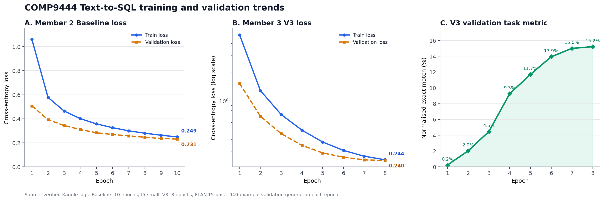

# Member 3——三轮模型改进方法与完整实验结果

本节介绍 Member 3 在 Text-to-SQL 任务上完成的三轮模型改进。三轮正式实验均使用随机种子
42，并在清洗后的 9,397 条样本上采用相同的 80/10/10 行级划分：7,517 条训练样本、940
条验证样本和 940 条测试样本。本文的测试指标均来自完整 940 条测试集，不是 smoke test
或抽样结果。

## 1. 改进动机与 Baseline 限制

Member 2 使用 `t5-small` 建立 Baseline：模型直接读取原始 Prompt，并使用 Greedy Search
生成 SQL。最终版本从预训练 `t5-small` 连续训练 10 个 Epoch，最低 Validation Loss 为
0.2306，并导出了完整 940 条测试预测。其 Normalised Exact Match 为 103/940（10.96%），
因此现在可以在相同测试顺序上与 Member 3 V3 进行完整配对比较。

初始方案主要存在以下问题：

1. 原始 Prompt 较长，问题和 Hint 位于后半部分，截断时可能丢失关键信息；
2. `t5-small` 容量有限，对复杂 Join、聚合和嵌套查询的建模能力不足；
3. Greedy Search 每一步只保留一个 Token，早期错误无法在后续解码中纠正；
4. 仅根据 Validation Loss 保存模型，不能保证所选 Checkpoint 的 SQL Exact Match 最优；
5. 数据集中等价但格式不一致的目标 SQL 会增加学习难度。

Member 3 因此依次完成 V1、V2 和 V3。V1 验证 Schema-aware 输入与 Beam Search 是否可行；
V2 引入紧凑 Schema、FLAN-T5-base 和 Schema 重排序；V3 再加入相关性排序、目标 SQL
规范化，以及基于完整验证集 Exact Match 的 Checkpoint 选择。

## 2. 三轮改进方法

### 2.1 V1：问题优先输入与 Beam 4

V1 从原始 Prompt 中提取数据库 Schema、自然语言问题和可选 Hint，删除重复任务说明，并把
问题移动到输入前部。V1 保留清理后的完整 DDL，使平均输入字符数从 1,436.33 降至
814.31，减少 43.31%。模型仍使用 `t5-small`，训练 3 个 Epoch，并分别输出 Greedy 和
Beam 4 预测。

V1 最终 Beam Exact Match 为 46/940（4.89%）。这证明方法可以运行，但准确率仍然较低，
因此继续进行 V2。

### 2.2 V2：紧凑 Schema 与 FLAN-T5-base

V2 将 DDL 解析为表名、列名和外键，再线性化为紧凑格式：

```text
translate natural language to SQLite:
question: <natural-language question>
hint: <optional hint>
schema:
tables: table_a(column_1, column_2); table_b(...)
foreign keys: table_a.column_1->table_b.column_1
```

平均输入字符数进一步降至 425.93，比原始 Prompt 减少 70.35%；最大输入字符数从 4,757
降至 1,168。V2 同时将模型升级为约 2.48 亿参数、经过指令微调的
`google/flan-t5-base`。推理时使用 Beam 8，并根据不存在的表、错误的列/别名和括号不平衡
等 Schema 违反情况重排序候选 SQL。

V2 的改动是“紧凑输入、更强模型、训练配置和解码”的组合，因此结果属于系统级比较，不能
把全部提升归因于单一组件。

### 2.3 V3：相关标识符优先的 Schema 排序

V3 根据自然语言问题和 Hint 中出现的词，对表名与列名进行确定性的相关性排序，把更可能
相关的标识符放在 Schema 前部。该方法不会删除任何表、列或外键，只改变展示顺序，因此在
输入发生 Token 截断时，相关信息更有机会被模型保留。

数据集中的 Schema 最多包含 6 张表，所以本次实验没有激进裁剪 Schema。V3 平均输入字符数
为 452.93，最大为 1,195；它的目标是“排序关键信息”，而不是继续追求更短的输入。这个
限制也意味着 V3 的提升不能简单解释为输入长度进一步缩短。

### 2.4 V3：目标 SQL 规范化

V3 在 Tokenization 前对训练目标进行保守的格式规范化，包括统一 SQL 关键字、逗号、括号
和运算符周围的空格，同时保持字符串字面量内容不变。对 9,397 条目标 SQL 的检查结果为：
空目标 0 条，并且规范化前后在本项目的 Normalised Exact Match 规则下有 0 条语义外的
文本不一致。该处理减少了模型学习无意义格式差异的负担。

### 2.5 V3：完整验证集 Exact Match 选择 Checkpoint

V2 根据最低 Validation Loss 保存模型。V3 每个 Epoch 除计算 Token-level Validation Loss
外，还对完整 940 条验证集执行生成，并优先根据 Normalised Exact Match 选择最佳
Checkpoint；若 Exact Match 相同，再使用 Validation Loss 作为 tie-break。V3 最多训练
8 个 Epoch，并设置 Early Stopping patience 为 2。这样训练目标、模型选择指标和最终任务
指标更加一致。

V3 延续 V2 的 Beam 8、Length Penalty 0.9、Repetition Penalty 1.08 和 Schema 重排序权重
0.75。正式运行使用 Kaggle Tesla T4 x2 和 FP32；梯度累积后有效 Batch Size 为 4。

## 3. 实验设置

| 参数 | Member 2 Baseline | V1 | V2 | V3（最终） |
|---|---:|---:|---:|---:|
| 模型 | `t5-small` | `t5-small` | `google/flan-t5-base` | `google/flan-t5-base` |
| 输入 | 原始 Prompt | 问题优先 + 完整 Schema | 问题优先 + 紧凑 Schema | 问题优先 + 相关标识符优先 Schema |
| 训练/验证/测试 | 7,517 / 940 / 940 | 7,517 / 940 / 940 | 7,517 / 940 / 940 | 7,517 / 940 / 940 |
| Epoch | 10 | 3 | 5 | 8（patience 2） |
| Learning Rate | `5e-5` | `5e-5` | `1e-4` | `1e-4` |
| Micro Batch Size | 4 | 4 | 2 | 2 |
| 梯度累积 | 无 | 无 | 2 | 2 |
| Weight Decay | 默认 | 默认 | 0.01 | 0.01 |
| Warmup Ratio | 无 | 无 | 0.10 | 0.10 |
| 最大输入/输出长度 | 512 / 256 | 512 / 256 | 512 / 256 | 512 / 256 |
| Checkpoint 选择 | Validation Loss | Validation Loss | Validation Loss | 完整验证集 EM，再比较 Loss |
| 最终解码 | Greedy | Beam 4 | Beam 8 + Schema 重排序 | Beam 8 + Schema 重排序 |

## 4. 训练结果

### 4.1 Baseline、V1 与 V2 Loss

| 版本 | Epoch | Training Loss | Validation Loss |
|---|---:|---:|---:|
| Baseline | 1 | 1.0610 | 0.5069 |
| Baseline | 2 | 0.5774 | 0.3919 |
| Baseline | 3 | 0.4640 | 0.3432 |
| Baseline | 4 | 0.4006 | 0.3101 |
| Baseline | 5 | 0.3571 | 0.2832 |
| Baseline | 6 | 0.3254 | 0.2685 |
| Baseline | 7 | 0.2992 | 0.2575 |
| Baseline | 8 | 0.2794 | 0.2454 |
| Baseline | 9 | 0.2626 | 0.2357 |
| Baseline | 10 | 0.2487 | 0.2306 |
| V1 | 1 | 1.1003 | 0.5123 |
| V1 | 2 | 0.5806 | 0.3949 |
| V1 | 3 | 0.4692 | 0.3460 |
| V2 | 1 | 4.2585 | 1.2530 |
| V2 | 2 | 1.1462 | 0.6524 |
| V2 | 3 | 0.7040 | 0.4594 |
| V2 | 4 | 0.5261 | 0.3814 |
| V2 | 5 | 0.4483 | 0.3544 |

### 4.2 V3 完整验证过程

| Epoch | Training Loss | Validation Loss | Validation Exact Match |
|---:|---:|---:|---:|
| 1 | 4.8961 | 1.5255 | 2/940（0.21%） |
| 2 | 1.2850 | 0.6943 | 19/940（2.02%） |
| 3 | 0.7242 | 0.4576 | 42/940（4.47%） |
| 4 | 0.4975 | 0.3453 | 87/940（9.26%） |
| 5 | 0.3744 | 0.2879 | 110/940（11.70%） |
| 6 | 0.3059 | 0.2602 | 131/940（13.94%） |
| 7 | 0.2661 | 0.2439 | 141/940（15.00%） |
| **8** | **0.2443** | **0.2401** | **143/940（15.21%）** |

V3 的 Loss 在 8 个 Epoch 中持续下降，验证 Exact Match 也持续提高，因此 Epoch 8 被保存为
最佳 Checkpoint。训练未出现非有限 Loss，总耗时约 297.45 分钟。

### 4.3 Loss 与验证指标趋势分析



**图 1.** Member 2 Baseline 的训练/验证 Loss、Member 3 V3 的训练/验证 Loss，以及 V3 在
完整940条验证集上的 Normalised Exact Match。V3 Loss 跨度较大，因此中图使用对数纵轴。

Baseline 的 Training Loss 从 1.0610 降至 0.2487，下降 76.56%；Validation Loss 从
0.5069 降至 0.2306，下降 54.50%。两条曲线在10个 Epoch 中均单调下降，末轮差值仅
0.0181，没有出现验证 Loss 回升或训练/验证曲线明显分离，因此当前日志没有显示过拟合。
不过，Loss 只衡量 Token 级预测，不代表整条 SQL 已经正确。

V3 的 Training Loss 从 4.8961 降至 0.2443，下降 95.01%；Validation Loss 从 1.5255
降至 0.2401，下降 84.26%，末轮差值为0.0042。与此同时，Validation Exact Match 从
0.21% 提高到15.21%。最大单轮增幅发生在 Epoch 3 到 Epoch 4，增加4.79个百分点；到
Epoch 7 至 Epoch 8 时，Validation Loss 仅下降0.0037，Exact Match 只增加0.21个百分点，
说明模型后期已进入收益递减阶段。继续少量训练可能仍有小幅收益，但要获得明显提升，更应
依靠数据质量、模型结构、Schema Linking 或解码策略，而不是单纯增加 Epoch。

由于 Baseline 与 V3 使用不同模型和目标格式，二者 Loss 的绝对数值不能直接解释为准确率
高低；图中 Loss 主要用于观察各自训练过程是否收敛和是否出现过拟合。

## 5. 完整测试集结果

当前使用 Normalised Exact Match 作为可重复诊断指标。比较前将 SQL 转为小写、合并多余
空格、统一标点及 `!=`、`<=`、`>=`、`<>` 等运算符周围的空格，并移除末尾分号。
Baseline 与 V3 的预测均为940条且顺序一致。由于两个 T5 Tokenizer 对标签空格的解码存在
差异，8行参考 SQL 只在字符串字面量邻近空格上不同；程序仅使用忽略空格的键验证这些行的
对应关系，Exact Match 判定仍分别使用各结果文件记录的参考 SQL。

| 系统 | 测试样本 | 正确数 | Normalised Exact Match |
|---|---:|---:|---:|
| Member 2 `t5-small` Baseline（10 Epoch，Greedy） | 940 | 103 | 10.96% |
| V1 Schema-aware Greedy | 940 | 42 | 4.47% |
| V1 Schema-aware Beam 4 | 940 | 46 | 4.89% |
| V2 FLAN-T5-base Greedy | 940 | 81 | 8.62% |
| V2 Beam 8 + Schema 重排序 | 940 | 98 | 10.43% |
| V3 相关性排序 + 规范目标 Greedy | 940 | 133 | 14.15% |
| **V3 Beam 8 + Schema 重排序（最终）** | **940** | **166** | **17.66%** |

V3 同模型消融中，Beam 8 + Schema 重排序将正确数从 133 提高到 166，增加 33 条，绝对
提升 3.51 个百分点，相对 Greedy 提升约 24.81%。其中 42 条仅由 Beam 方法生成正确，9 条
仅由 Greedy 生成正确，124 条两种方法都正确。

与 Member 2 的最终 Baseline 相比，V3 从 103/940 提高到 166/940，增加 63 条，绝对提升
6.70 个百分点，相对提升约 61.17%。配对统计中，两者都正确72条，只有 Baseline 正确31条，
只有 V3 正确94条，两者都错误743条。这说明改进方法带来的新增正确样本明显多于回退样本。

V3 最终方法相较 V2 最终方法从 98/940 提高到 166/940，增加 68 条，绝对提升 7.23 个
百分点，相对提升约 69.39%，结果约为 V2 的 1.69 倍。相较 V1 的 46/940，V3 增加 120
条，说明 V3 的训练目标规范化、任务指标驱动的 Checkpoint 选择和更充分训练形成了明显的
系统级改进。

## 6. 指标解释与 Member 4 后续评估

17.66% 是严格的字符串级完全匹配，不等于 SQL 的真实语义准确率。不同别名、条件顺序或
等价子查询可能执行结果相同，但仍会被 Exact Match 判错。最终报告应分别给出：

1. **Normalised Exact Match**：严格、可重复的文本指标；
2. **SQL Validity**：SQL 是否满足语法与 Schema 约束；
3. **Execution Accuracy**：预测 SQL 与参考 SQL 的执行结果是否相同。

### 6.1 SQLGlot SQL Validity Rate

本项目新增 `SQLGlot Validity Rate` 作为第二项自动指标。对每条预测使用 SQLGlot 30.13.0
按 SQLite 方言解析；预测必须非空、只能包含一条语句，而且顶层必须是查询表达式。满足这些
条件记为 Valid。该指标不读取数据库实例，不验证表名和列名是否存在，也不执行 SQL，因此
只能反映语法与基本查询结构是否可解析。

| 系统 | Valid SQL | SQLGlot Validity Rate |
|---|---:|---:|
| Member 2 Baseline Greedy | 829/940 | 88.19% |
| Member 3 V2 Beam + Schema 重排序 | 822/940 | 87.45% |
| Member 3 V3 Greedy | 836/940 | 88.94% |
| **Member 3 V3 Beam + Schema 重排序** | **849/940** | **90.32%** |

V3 最终方法比 Member 2 Baseline 多生成20条可解析查询，Validity Rate 绝对提高2.13个百分点；
相较 V2 提高2.87个百分点。V3 的 Beam + Schema 重排序又比同一模型的 Greedy 多13条可解析
查询，提高1.38个百分点。V3 仍有91/940条预测因 SQLGlot Parse Error 判为无效，说明语法
稳定性已经较高但仍有改进空间。

不建议把三种含义不同的指标简单平均。Member 4 应优先使用
`results/member3/v3_full_run/improved_predictions.csv` 进行 SQL Validity、Execution
Accuracy 和错误类型分析，并可使用同目录下的 Greedy 文件进行配对消融。

## 7. V3 复现方法与交付文件

```bash
python -m src.improvement \
  --model_name google/flan-t5-base \
  --dataset_path "/path/to/training_no_cot_dataset.csv" \
  --epochs 8 \
  --batch_size 2 \
  --gradient_accumulation_steps 2 \
  --learning_rate 1e-4 \
  --weight_decay 0.01 \
  --warmup_ratio 0.10 \
  --max_grad_norm 1.0 \
  --num_beams 8 \
  --length_penalty 0.9 \
  --repetition_penalty 1.08 \
  --schema_rerank_weight 0.75 \
  --early_stopping_patience 2 \
  --results_dir results/member3/v3_full_run \
  --checkpoint_dir checkpoints/member3_v3 \
  --no_fp16
```

V3 交付目录包含：

- `improved_training_log.csv`：8 个 Epoch 的 Loss 和完整验证集 Exact Match；
- `improved_greedy_predictions.csv`：完整 940 条 Greedy 预测；
- `improved_predictions.csv`：完整 940 条最终 Beam + Schema 重排序预测；
- `beam_search_comparison.json`：Greedy 与最终方法的配对统计；
- `baseline_v3_comparison.json`：Member 2 Baseline 与 V3 的完整940条配对统计；
- `sqlglot_validity_comparison.json`：Baseline、V2、V3 Greedy 与 V3 最终方法的 SQL Validity Rate；
- `v3_sqlglot_validity.csv`：V3 最终940条预测的逐条 SQLGlot 有效性和解析错误；
- `docs/experiments/plot_member3_training_trends.py`：读取正式 CSV 并重新生成趋势图；
- `docs/experiments/evaluate_member3_sql_validity.py`：重新计算 SQLGlot Validity Rate；
- `docs/experiments/figures/member3_training_trends.png`：报告使用的训练趋势图；
- `README_CN.md`：结果说明与 Member 4 使用建议。

训练好的 FLAN-T5-base Checkpoint 体积较大，不放入 GitHub；可从 Kaggle V9 Output 或小组
约定的大文件渠道分享。项目中的 `checkpoints/` 只作为本地训练输出目录。

## 8. 局限性

首先，Baseline 与 V3 使用不同的 T5 Tokenizer，标签解码后有8行出现字符串字面量邻近
空格差异；本报告已验证940行顺序一致并保留各实验原有 Exact Match 口径，但最终统一评估
仍应直接使用原始测试集参考 SQL。其次，V2 到 V3 同时改变了 Schema 顺序、训练目标格式、
Checkpoint 选择和训练轮数，因此属于组合改进，不是单变量消融。第三，随机行级划分可能
使同一数据库 Schema 同时出现在训练集和测试集；若要评估对全新数据库的泛化能力，需要
额外进行 Schema-disjoint Split。最后，Schema 重排序是启发式规则，不能保证 SQL 一定
可执行或语义正确，Execution Accuracy 仍需 Member 4 使用数据库实例补充。
